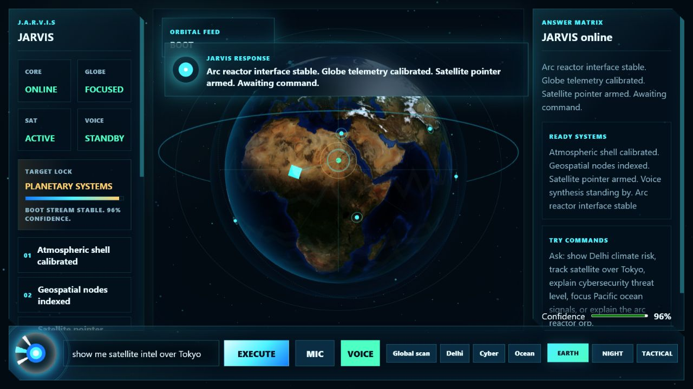
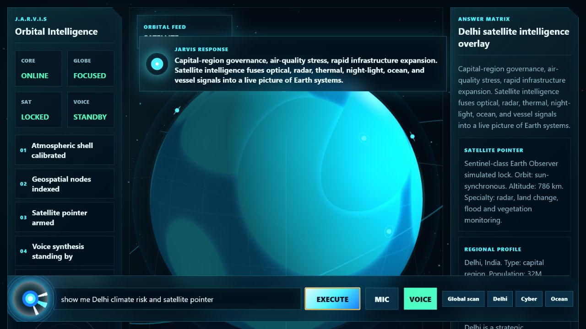
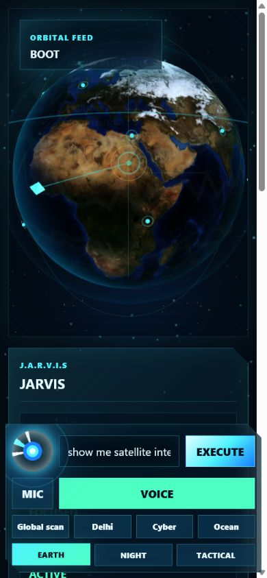

# JARVIS

JARVIS is a futuristic browser-based assistant interface built around a high-resolution interactive Earth, satellite-style target locks, a glowing blue arc-reactor command orb, voice-capable commands, animated intelligence cards, and a deterministic local response engine.

The project is designed to feel like an advanced mission-control assistant: ask a question, select a region on the globe, or trigger a scan, and JARVIS overlays structured information with smooth motion, live telemetry, and a cinematic blue interface.



## Repository Description

**GitHub description:** Futuristic JARVIS-style AI assistant UI with a high-resolution Three.js Earth, satellite targeting, glowing arc-reactor command orb, voice commands, tests, docs, and production-ready upgrade notes.

Recommended topics:

`jarvis`, `threejs`, `vite`, `ai-assistant`, `globe`, `earth`, `satellite`, `voice-ui`, `mission-control`, `javascript`, `frontend`, `cyberpunk-ui`

## Highlights

- Full-screen 3D Earth powered by Three.js.
- NASA Blue Marble topography/bathymetry imagery for a realistic high-resolution planet surface.
- NASA city-lights texture blended on the night side of the globe.
- Earth, Night, and Tactical display modes.
- Orbital satellite animation with a beam pointer and target-lock reticle.
- Smooth globe focusing for major world nodes and coordinate-based scans.
- Blue arc-reactor style taskbar orb with hover, press, pulse, and command states.
- Typed command input plus browser speech synthesis and speech recognition where supported.
- Floating JARVIS response overlay with animated answer cards.
- Live telemetry stream, scan progress, target state, signal strength, and command feedback.
- Mobile layout support with reduced-motion accessibility handling.
- Deterministic local intelligence engine covered by tests.
- Security and production hardening notes included in the repo.

## Demo Screens





## Quick Start

```powershell
npm install
npm run start
```

Open:

```text
http://127.0.0.1:4373
```

## Validate

```powershell
npm run validate
```

`npm run validate` runs the unit tests and production build.

For the full release check:

```powershell
npm test
npm run build
npm audit --audit-level=moderate
```

## Example Commands

- `show me satellite intel over Tokyo`
- `show Delhi climate risk`
- `track satellite over Singapore`
- `explain cybersecurity threat level`
- `focus Pacific ocean climate signals`
- `explain the arc reactor blue orb`
- `scan lat 40.7 lon -74.0`

## Project Structure

```text
jarvis/
  index.html                 App shell and interface markup
  src/
    main.js                  Three.js scene, globe controls, command UI, animations
    intelligence.js          Local command interpretation and structured responses
    globeData.js             Globe targets, telemetry, and regional metadata
    styles.css               Futuristic UI, responsive layout, motion, accessibility
  public/assets/earth/       Earth and night-lights textures
  tests/                     Node test suite for assistant behavior
  docs/
    architecture.md          System architecture and module map
    desktop-packaging.md     Electron/Tauri packaging path for a real desktop assistant
    feature-map.md           Feature inventory and implementation coverage
    upload-manifest.md       What should and should not be published to GitHub
    screenshots/             Verified desktop and mobile screenshots
  SECURITY.md                Security model and hardening checklist
```

## How The Assistant Works

JARVIS is currently a local deterministic prototype. The interface routes user commands through the local intelligence module, matches command intent, selects relevant globe targets, updates the satellite/reticle state, and renders structured response cards. This keeps the demo fast, private, and testable while leaving a clean path to connect a real LLM, retrieval layer, live geospatial feeds, and desktop overlay permissions later.

The globe layer is interactive and visual-first: a user can click target nodes, type a mission-style query, or use supported browser voice APIs. The app then synchronizes globe focus, scan progress, telemetry updates, and the hovering assistant panel so the UI feels like one coordinated system.

## Documentation

- [Architecture](docs/architecture.md)
- [Feature Map](docs/feature-map.md)
- [Desktop Packaging Plan](docs/desktop-packaging.md)
- [Upload Manifest](docs/upload-manifest.md)
- [Security Notes](SECURITY.md)

## Research Grounding

- Three.js renderer and controls documentation: https://threejs.org/docs/
- OrbitControls documentation: https://threejs.org/docs/pages/OrbitControls.html
- Web Speech API documentation: https://developer.mozilla.org/en-US/docs/Web/API/Web_Speech_API
- SpeechRecognition documentation: https://developer.mozilla.org/en-US/docs/Web/API/SpeechRecognition
- NASA Blue Marble Next Generation topography/bathymetry imagery: https://science.nasa.gov/earth/earth-observatory/blue-marble-next-generation/base-topography-bathymetry/
- NASA Scientific Visualization Studio Earth city-lights texture: https://svs.gsfc.nasa.gov/30003/

## Production Upgrade Path

To turn this prototype into a real desktop JARVIS:

- Wrap it in Electron or Tauri for a tray/taskbar presence.
- Add a global shortcut and transparent always-on-top assistant overlay.
- Connect live geospatial APIs such as NASA Earthdata, Sentinel Hub, NOAA, USGS, AIS vessel feeds, and weather alerts.
- Add an LLM tool layer with retrieval, citations, and permissions-aware actions.
- Store long-term user preferences in encrypted local storage.
- Add wake-word detection, local speech-to-text, and a secure permissions console.
- Add signed builds, update channels, crash reporting, and security review gates.

## License

This project is currently marked `UNLICENSED` in `package.json`. Add a license before accepting external contributions or reuse.
