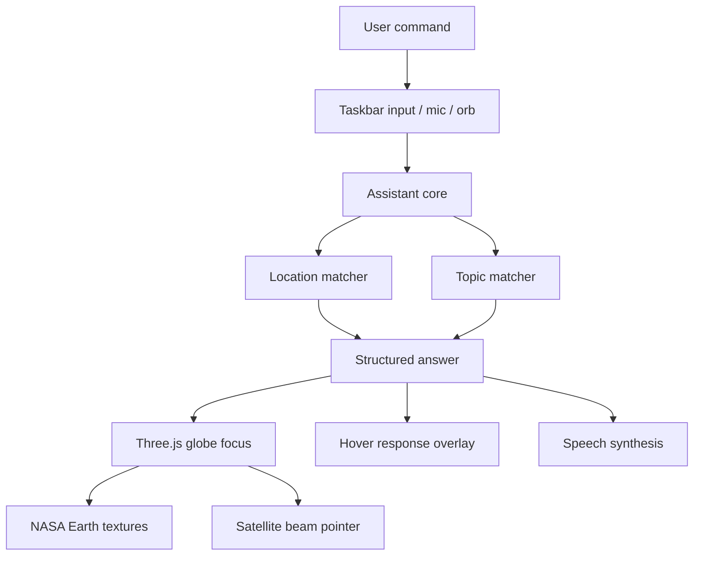

# Architecture

## Modules

- `src/main.js`: UI events, voice, answer rendering, and app bootstrap.
- `src/globe.js`: Three.js scene, NASA Earth texture shader, atmosphere, markers, satellite orbit, pointer beam.
- `src/core/assistantCore.js`: command interpretation and answer generation.
- `src/core/geo.js`: coordinate math, distance, nearest node, coordinate parsing.
- `src/data/worldIntel.js`: indexed globe locations, topics, satellites, startup signals.

## Why It Is Testable

The command intelligence and coordinate logic are pure modules. The visual layer consumes their output but does not own the reasoning. This keeps the app flashy without making it fragile.

## Earth Rendering

The globe uses local NASA-derived assets in `public/assets/earth`:

- `world-topo-bathy-5400.jpg`: Blue Marble Next Generation topography/bathymetry map.
- `earth-night-4096.jpg`: compressed Earth city-lights texture derived from NASA SVS imagery.

`src/globe.js` blends the day and night textures in a shader using a fixed sun direction, rim atmosphere, subtle ocean glint, and a separate translucent cloud shell.
