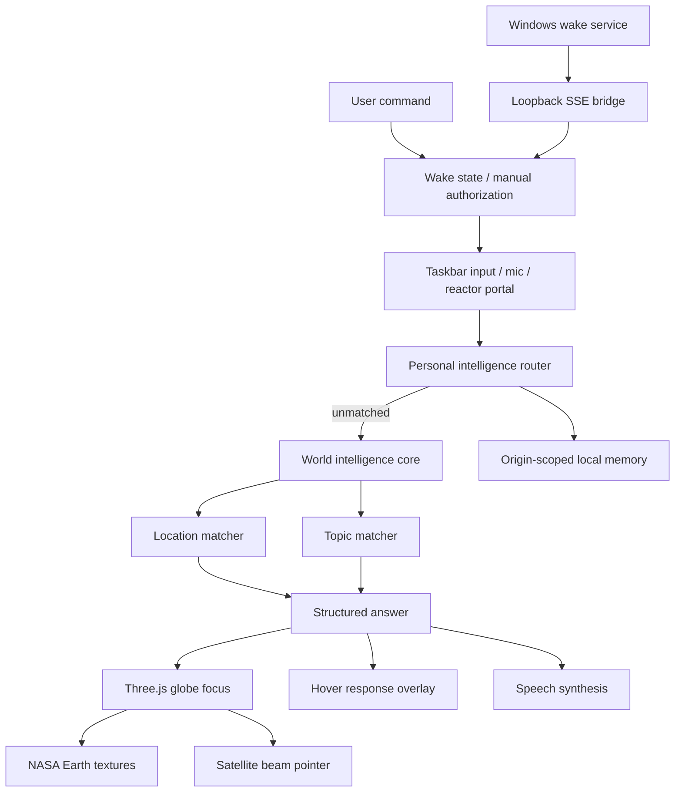

# Architecture

## Modules

- `src/main.js`: UI events, voice, answer rendering, and app bootstrap.
- `src/globe.js`: Three.js scene, NASA Earth texture shader, atmosphere, markers, satellite orbit, pointer beam.
- `src/core/assistantCore.js`: command interpretation and answer generation.
- `src/core/wakeWord.js`: pure wake phrase parser and deterministic wake state reducer.
- `src/core/personalIntelligence.js`: local note, daily brief, clock, date, and diagnostic routes.
- `src/core/commandHistory.js`: bounded, resilient recent-command persistence.
- `src/core/geo.js`: coordinate math, distance, nearest node, coordinate parsing.
- `src/data/worldIntel.js`: indexed globe locations, topics, satellites, startup signals.
- `desktop/server.mjs`: loopback-only production asset server and Server-Sent Events wake bridge.
- `desktop/JarvisWake.ps1`: phrase-limited Windows speech recognizer and interface foreground controller.

## Why It Is Testable

Wake transitions, personal routes, storage normalization, command intelligence, coordinate logic, asset resolution, and the desktop bridge are independently testable modules. The visual layer consumes their output but does not own the reasoning. This keeps the app cinematic without making it fragile.

## Earth Rendering

The globe uses local NASA-derived assets in `public/assets/earth`:

- `world-topo-bathy-5400.jpg`: Blue Marble Next Generation topography/bathymetry map.
- `earth-night-4096.jpg`: compressed Earth city-lights texture derived from NASA SVS imagery.

`src/globe.js` blends the day and night textures in a shader using a fixed sun direction, rim atmosphere, subtle ocean glint, and a separate translucent cloud shell.
