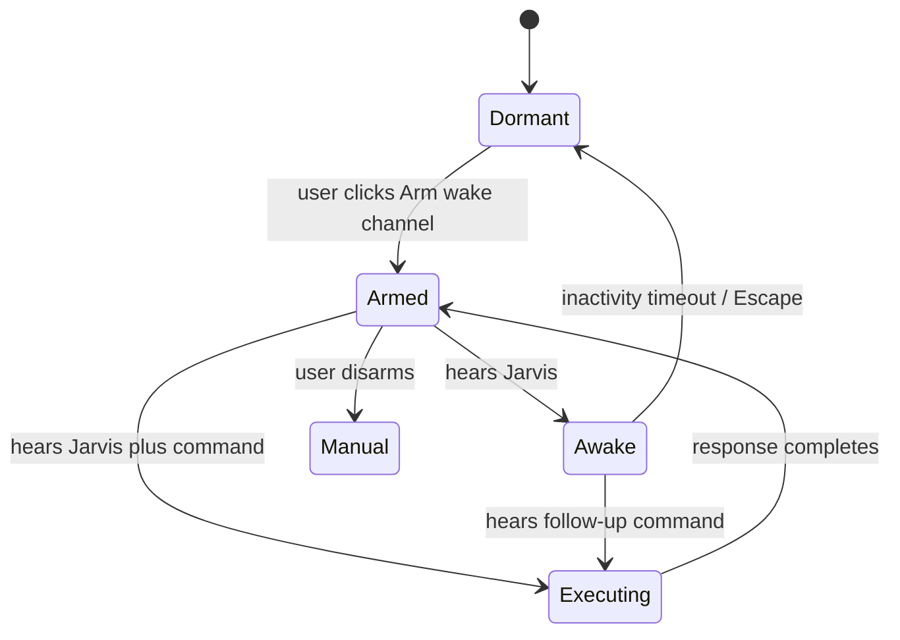
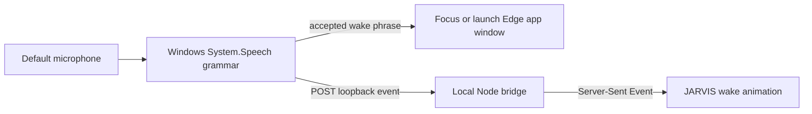

# Wake-word Architecture

## Browser Flow

`src/core/wakeWord.js` owns the pure phrase parser and state reducer. `src/main.js` owns browser permissions, recognition lifecycle, interface animation, and speech output. Keeping phrase interpretation independent from browser events makes the critical transitions deterministic and unit-testable.

The browser recognizer supports both:

- `Jarvis, show me Tokyo satellite intelligence`
- `Jarvis` followed by `show me Tokyo satellite intelligence`

The second form mirrors a natural wake/follow-up interaction. Speech output pauses wake recognition and restarts it after synthesis completes to reduce the chance of JARVIS hearing itself.

## Desktop Flow

The desktop companion deliberately limits its grammar to wake phrases. Free-form speech stays inside the visible interface, where the user can see microphone state and disable it.

## Failure Handling

- Unsupported Web Speech API: manual entry remains available and wake controls are disabled.
- Blocked microphone permission: wake mode disarms and the portal explains the failure.
- Browser recognition ends unexpectedly: armed mode restarts after a short backoff.
- No speech: treated as normal silence while armed, not as a user-facing error.
- Speech synthesis active: wake recognition waits until output completes.
- Desktop bridge absent: normal Vite/browser mode never attempts an event-stream connection.

## Privacy Boundaries

- Browser wake mode begins only after a user gesture and visible permission prompt.
- Browser speech recognition may be server-backed depending on the browser.
- Desktop wake recognition uses the installed Windows recognizer and does not persist audio.
- Personal notes use origin-scoped `localStorage`; they are not encrypted and should not contain secrets.
- No spoken input can execute shell commands, open files, or call arbitrary URLs in this version.
